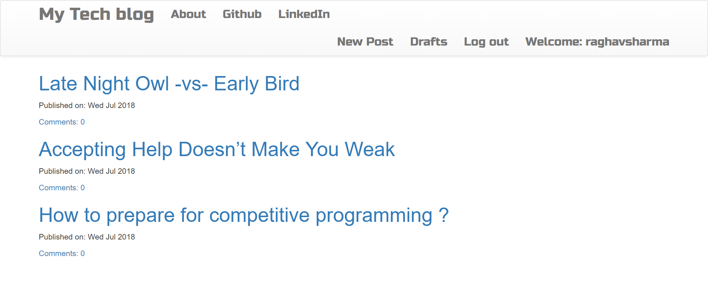
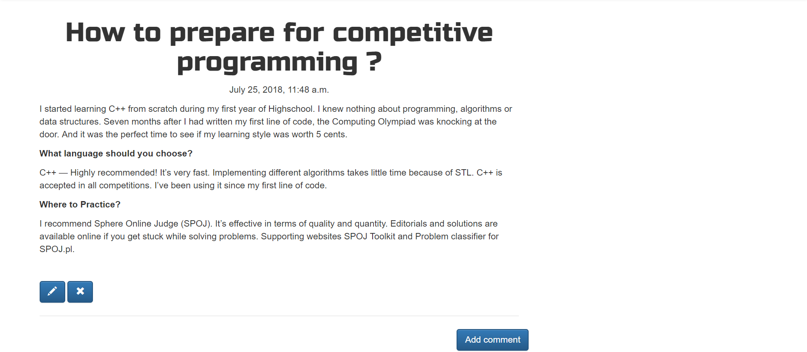

# Personal Blog
This project is personal blog website implementation in django(Python based web framework). Here, one person can write blogs. Others can share their responses by comments.  
To use this project, you need to install Python 3.7, django(must) and set-up your virtual environment(optional).  
Links for installing :  
1.[Python Installation](https://conda.io/docs/installation.html)  
2.[Django Installation](https://docs.djangoproject.com/en/2.0/topics/install/)  
3.[Virtual Environment Setup](https://uoa-eresearch.github.io/eresearch-cookbook/recipe/2014/11/26/python-virtual-env/)  

  
Once, you are done with the above tasks, clone or download the project your local machine.  
Before running the project, make sure to apply pending migrations.  
  
Run these commands to apply migrations :  
- python manage.py migrate  
- python manage.py makemigrations  
  
When running the above 2 commands, if any errors pop up, please check you are under the right sub-directory that is blog_project.  
  
Now it is time to create a superuser/admin for the blog. Superuser will be the one who can write blogs, edit or even delete them.  
To do so run the command  
- python manage.py createsuperuser  
You will be asked for username and password. Once you fill it. Wham! you are a superuser.  

After this, its time to run the project.  
Under the same directory blog_project run the command.  
- python manage.py runserver
  
If you followed every step as mentioned your web application will start running on local host.  
  
# Home Page  
  
The homepage shows the list of all your blogs which are published.  
The unpublished blogs are saved as drafts.  
  
The post detail view is like this:  

